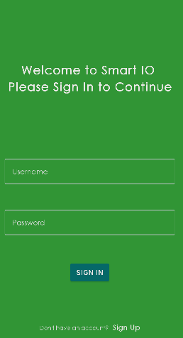
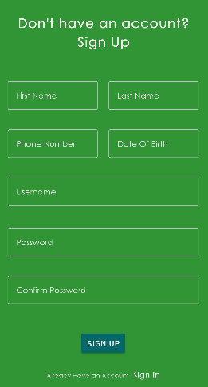
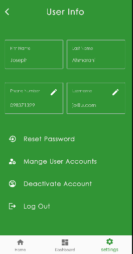
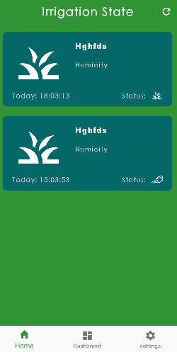
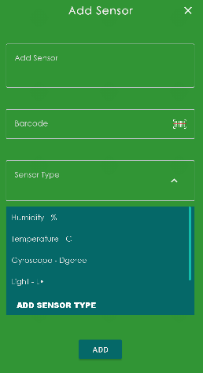
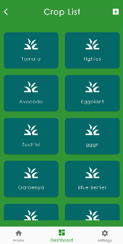
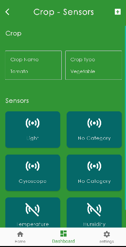
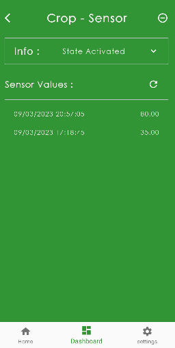

# Smart-IO
Android project to get information from the back end using Restful API.      
     
The proposed system dives into agricultural scope by tracking the sensor's value assigned to the plant and managing the irrigation status.  
    
The Android application communicates with the back-end to get, update, and add new data to the database within the application.

# Disclamer
This app is part of a project that has been set up for demonstration purposes only!    
    
The Android project is connected to a back-end server not properly configured for security purposes. Any sensitive information sent using the Android app can be vulnerable to outside attacks. 

# Technologies Used
<ul>
  <li>Navigation Component: To navigate between fragments</li>
  <li>Koin: For Dependency Injection</li>
  <li>Kotlin Coroutines: Library for executing multi-thread operations </li>
  <li>GSON: Used for getting server response </li>
  <li>Retrofit: A Restful API used to execute get and post requests to the back-end server </li>
</ul>  

# App Feature
<ul>
  <li>User Authentication: Login or Sign Up before starting to use the app </li>
  <li>Group Policy: System has to type of user Manager and regular user</li>
  <li>User Management: Edit user information, manage other users connected to it, and deactivate the account</li>
  <li>Add new Crop or Sensor by managers</li>
  <li>Assign Crop or Sensor to any user</li>
  <li>Assign sensor to Crop</li>
  <li>List sensor's value </li>
  <li>Control the irrigation status manually</li>
</ul> 

# Screenshots 
<h2>1. Login</h2> 

<h2>#2. Sign UP </h2>

<h2>#3. User Info </h2>

List User Info and update his phone number or email address.     
    
If the user has a manager role then he can open the Manage User Account menu, which will list the entire users assigned to him and will have the opportunity to activate or de activate any user from the list and assign any regular user to him.

<h2>4. Home</h2> 

List all the crops that are being irrigated or the ones that stopped, by the day of the request

<h3>#5. Add Sensor </h3>

If the User has a manager role, he can add a new sensor to the database.       
 
 
Clicking on the Barcode will redirect the user to the QR Scanner page, which will let the user scan the QR code of the sensor. When the scanner detects a QR code, the app will send the user back to the Add Sensor page and fill the QR tab with the detected QR code.      
 
 
The user can assign a type to the sensor from the list of types or press the Add Sensor Type. Doing so will redirect the user to the Add Sensor Type page

<h2>6. Crop List </h2> 

<h2>7. Crop-Sensors </h2> 

List all the Sensors assigned to a selected plant.   
     
Users can also assign a new sensor to the plant by clicking on the + button

<h2>8. History </h2> 

Display all the sensor’s values by date.     
    
The user can deactivate the crop-sensor assignment by clicking on the - button

